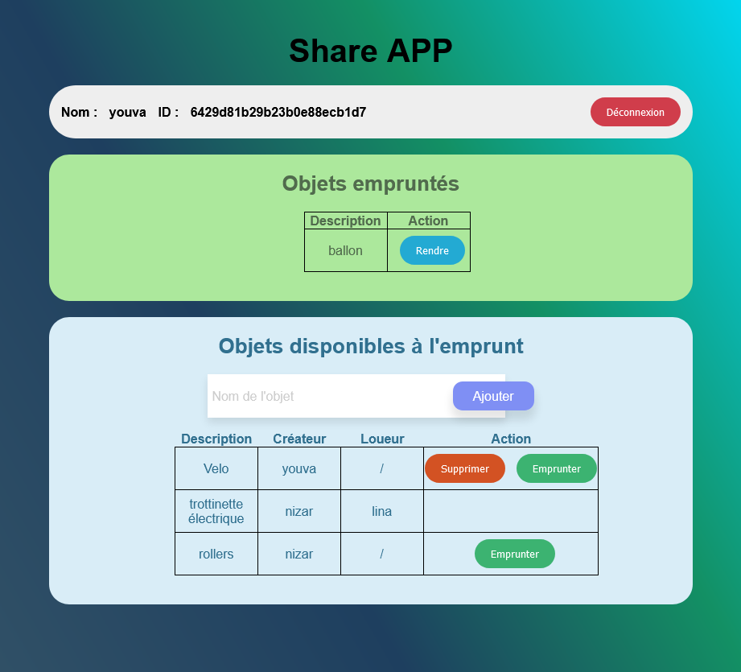

# Projet 2 JSFS - Application de partage d'objets


## Description du projet :

Cette application web de partage d'objets permet aux utilisateurs de partager et d'emprunter des objets entre eux.

Les clients s'inscrivent sur l'application, puis se connectent. Une fois connectés ils ont la possibilité d'ajouter des objets, d'emprunter des objets ou encore de supprimer leurs objets de la liste des objets disponible à l'emprunt.


  


### Installation 


Après le clone du dépot, ce placer à la racine du projet dans le dossier "appPartage/" et initialiser le projet.  
```
npm i
```

Lancer le serveur mongodb.
```
mongod --dbpath server/config
```

Lancer l'application ShareApp
```
nodemon
```

L'application est lancer sur : http://localhost:3000/


### - Technologies utilisés 
- Express
- socketIO
- Jwt
- mongoDb

### - Routes principale index
index.html

    Chemin: /home
    Méthode: POST
    Données de la requête: empty
    Réponse: renvoie le contunu de la page index.html


### - Routes Utilisateurs

Connexion

    Chemin: /user
    Méthode: POST
    Données de la requête: login, password
    Réponse: Statut de succès ou message d'erreur

Inscription

    Chemin: /user/register
    Méthode: POST
    Données de la requête: name, login, password
    Réponse: Statut de succès ou message d'erreur


Déconnexion

    Chemin: /user/logout
    Méthode: POST
    Réponse: Statut de succès ou message d'erreur

Récupérer les informations de l'utilisateur 

    Chemin: /user/me
    Méthode: GET
    Réponse: Informations de l'utilisateur courant (ID et nom)

### - Routes Objets

Créer un objet

    Chemin: /objects
    Méthode: POST
    Données de la requête: description
    Réponse: Nouvel objet créé

Récupérer tous les objets disponibles

    Chemin: /obj/list
    Méthode: GET
    Réponse: Liste des objets 

Emprunter ou rendre un objet

    Chemin: /obj/update
    Méthode: POST
    Données de la requête: Id_Objet, Id_utilisateur 
    Réponse: Statut de succès ou message d'erreur

Supprimer un objet

    Chemin: /obj/dell
    Méthode: post
    Données de la requête: Id_Objet
    Réponse: Statut de succès ou message d'erreur

